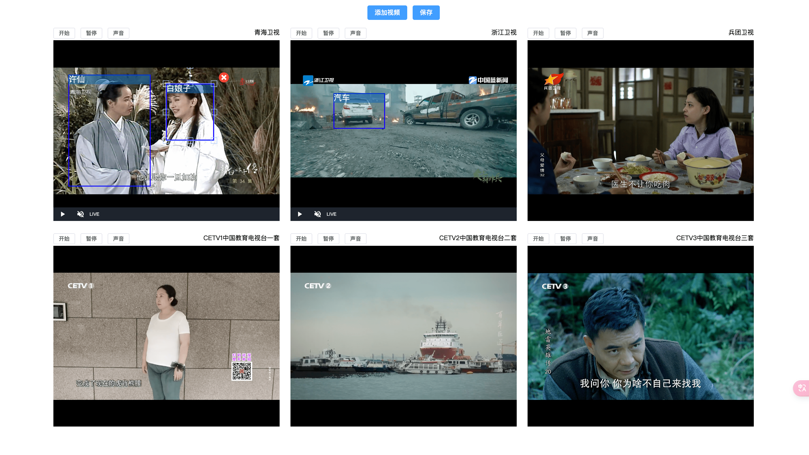

# live-video

出于浏览器权限限制<https://developer.chrome.com/blog/autoplay?hl=zh-cn>视频可以做到`autoplay`，但是需要视频设置成静音（可以通过后续的用户操作打开声音）

+ 使用到的框架: `Vue` `video.js` `fabric` 等
+ 在线预览地址: <https://ckvv.github.io/live-video/>
+ 视频来源: 国内 `IPTV` 直播<https://github.com/joevess/IPTV>

## 功能

### 视频流展示

+ 页面上能够同时展示多路视频直播流
+ 允许用户通过输入或选择地址自定义添加其他视频（m3u8、mp4、flv 等等）
+ 能够独立控制视频的播放、暂停、声音等功能

### 画框标注

+ 用户可以在视频上面通过**点击并拖动**鼠标在视频流上画框。
+ **点击**画框激活可以调整大小和位置。
+ 每个画框有一个删除按钮，点击后可以删除该标注框及标注信息
+ 支持在标注框上显示标注信息、可以**双击标签**自定义标注信息

### 其他

+ 点击`保存`按钮，可以查看当前视频信息及标注框信息
+ 标注框信息包括: 标注框在视频上的位置和大小（相对于视频流左上角位置的百分比）、标注信息（例如人物名字或物体类别）
+ 支持不同分辨率尺寸的视频流画框
+ 响应式设计，不同尺寸的设备上都有良好的用户体验

## 运行环境

+ Node.js >= 20
+ pnpm 9.4.0

## 运行步骤

+ 如果没有安装 pnpm 需要先执行 `corepack enable`
+ `pnpm install`: 安装依赖
+ `pnpm dev`: 启动 Vite 的开发服务器

# 截图

标注

标注信息保存JSON

添加其他视频流

